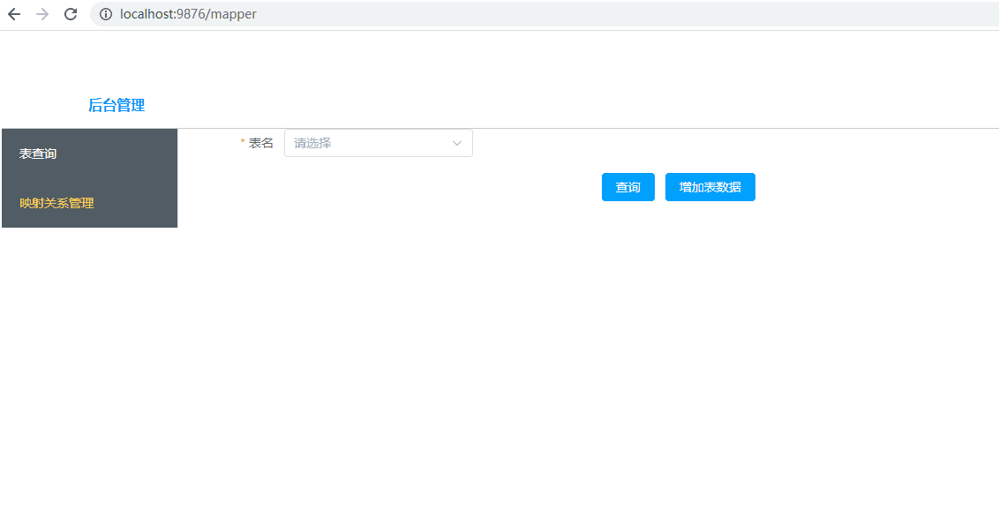

系统架构：
前台:Vue

后台:Spring Cloud + MyBatisPlus + MySQL

技术选型考虑点：
1.前台需要联动，数据需要分页显示，为了显示方便选用了vue
2.数据库实际不一定是MySQL，考虑JPA连接或者MybatisPlus，方便更改数据库连接,为了开发方便目前只考虑mysql数据库

启动操作：
1.在数据库创建建表语句
2.修改application.properties里的数据库连接，用户名，密码
3.启动后台mapper
4.启动前台vue

已完成的功能点：
1.映射页面的增删改查，自动获取当前表空间下的表名和表信息给前台展示
2.查询页面根据条件查询显示指定表名下的分页数据

此次因时间关系未完成的功能点：
1.部分校验未添加
2.部分选择后的联动自动填充未添加
3.查询条件应该有分级and or 多层级显示，包括数量限制等功能
4.未完成多表组合查询，和分组查询功能
5.测试用例未编写

